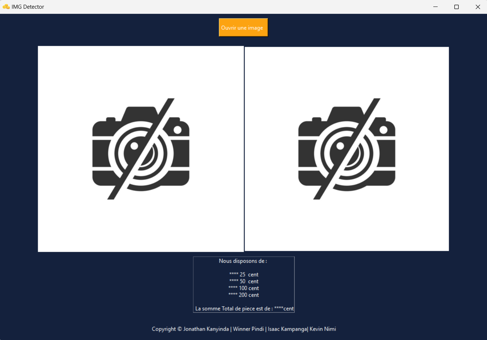
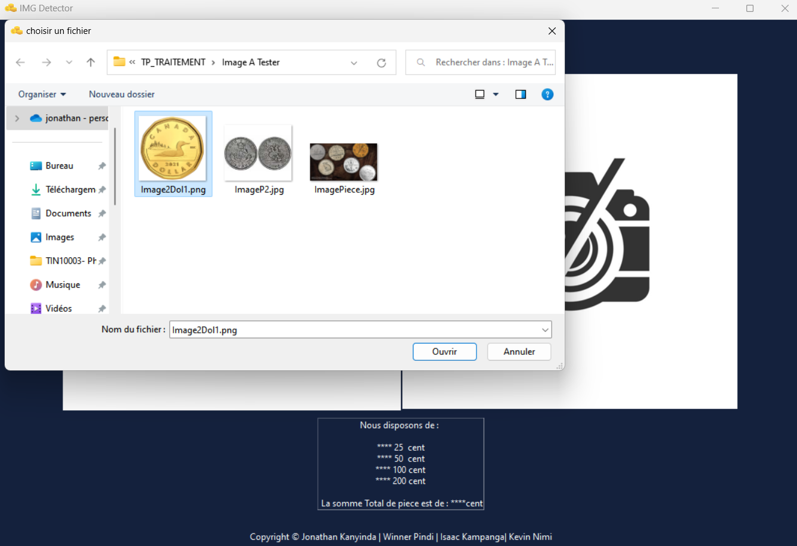
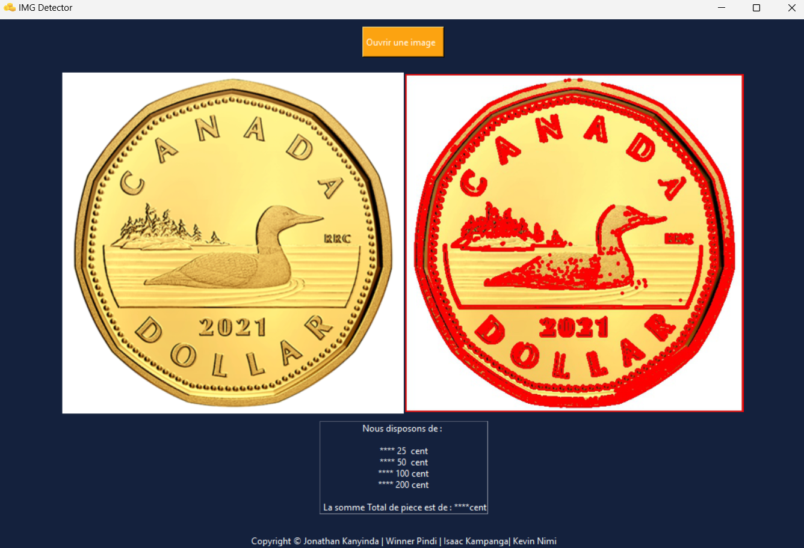

# IMG Detector Readme

---

## Description

This application allows for the detection of coins in an image and calculates the total amount of coins present. It is implemented using Python.

---

## Getting Started

### Prerequisites

-   Python
-   tkinter
-   PIL
-   cv2

### Installation

1. Clone the repository.
2. Ensure the required libraries are installed.
3. Run the application.

---

## Usage

1. Launch the application.
2. Click on the "Ouvrir une image" button to choose an image.
3. Select the desired image from your files.
4. Confirm the selection to display the original image and the image with contours.
5. The image with contours is automatically saved as "imgageContours.jpg".

---

## Authors

-   Jonathan Kanyinda Mwamba
-   Isaac Kampanga
-   Kevin Nimi
-   Winner Mazonzika Pindi

---

## Interface Screenshots

---

## Date

14th February 2022

---

## Credits

© Jonathan Kanyinda | Winner Pindi | Isaac Kampanga | Kevin Nimi
